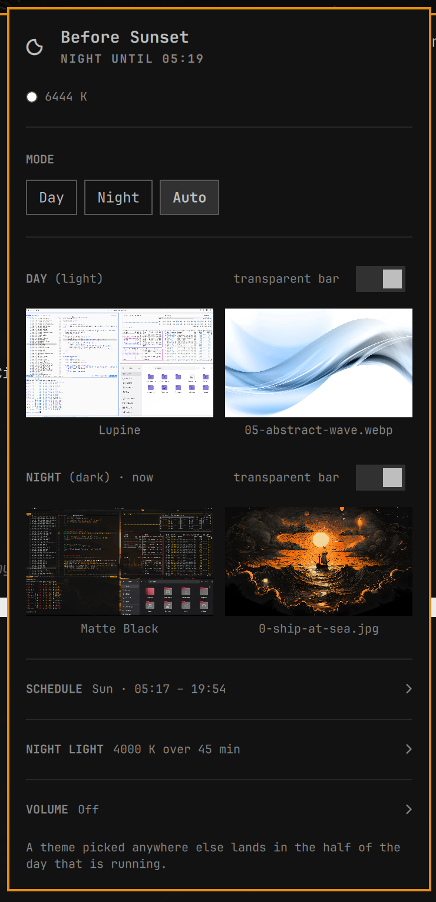

# Auto Theme

Follow the sun: one Omarchy theme through the day, another through the night,
each with its own wallpaper and its own answer to whether the top bar should be
transparent.



## Why this exists

Warp's terminal lets you nominate a light theme and a dark theme and then
forget about it — the editor follows the system, and each side keeps its own
look. I wanted that for the whole desktop, not one application: a bright theme
while the sun is up, something calmer after dark, each remembering the
wallpaper I picked for it, switching on its own.

Omarchy already has everything needed to do this well. Themes declare whether
they are light or dark, `omarchy theme set` retints the entire desktop in one
command, and the shell hosts long-running plugins. What was missing was
something to decide *when*, and somewhere to keep the two choices apart. That
is all this plugin is.

## What it does

- Switches themes at sunrise and sunset, computed locally from your
  coordinates — or at fixed clock times if you prefer.
- Remembers a background per theme and restores it, so an automatic switch
  never discards the wallpaper you chose.
- Remembers whether the top bar should be transparent per theme, because a
  wallpaper that works behind a transparent bar in one theme rarely does in
  another.
- Adopts any theme you pick elsewhere into whichever half of the day is
  running, so the schedule learns from what you actually do instead of
  fighting it.

## The two slots

The slots are called **day** and **night**, not light and dark, and they mean
exactly that: which half of the day they cover. Nothing stops you putting a
light theme in both — a bright one for daylight and a softer, warmer light
theme for the evening is a perfectly reasonable setup, and one the naming
would get in the way of if the slots were called "light" and "dark".

Each slot's theme is still labelled with what it reads as, because that is
useful to know. It just never constrains the choice.

## One rule

**A theme change lands in the slot that is currently in force.**

That holds wherever the change comes from — this panel, the theme switcher
(`Super + Ctrl + Shift + Space`), the Omarchy menu, `omarchy theme set`, a
keybinding of your own. Pick a theme during the day and it becomes your day
theme; pick one at night and it becomes your night theme. Nothing is reverted
behind your back, and nothing quietly expires at the next sunrise.

To step outside the schedule, pin a half. Pinning shows in the panel and stays
until you change it, which is the honest version of an override.

## Installation

```bash
omarchy plugin add https://github.com/priard/omarchy-auto-theme --enable
```

Then put the widget on the bar from the bar settings, or add it to
`~/.config/omarchy/shell.json` by hand:

```json
{ "id": "io.github.priard.auto-theme" }
```

The plugin seeds itself on first run: the theme already on screen takes the
slot matching its own light/dark reading, and the other slot gets a stock
counterpart. It starts working immediately without changing your desktop out
from under you.

## Removal

```bash
omarchy plugin remove io.github.priard.auto-theme
```

That leaves two things behind, both safe to delete:

```bash
rm ~/.local/state/omarchy/settings/auto-theme.json   # remembered backgrounds and transparency
```

and the plugin's entry in `~/.config/omarchy/shell.json`, if you added one by
hand. Your themes, wallpapers and bar settings are untouched — the plugin only
ever drove Omarchy's own commands.

## The panel

Click the bar icon. Right-click pins the other half without opening anything,
and pins back to Auto from there.

**MODE** — `Day` and `Night` pin one slot and stop the schedule. `Auto`
follows it.

**SCHEDULE** (Auto only) — `Sunrise to sunset`, or `Fixed hours` with a
from/to pair. The sunrise option only appears once a location is known;
without one there is nothing to compute, so the panel says so and offers fixed
hours alone.

**THEMES** — one row per slot: the theme it holds, what that theme reads as,
which slot is in force, and a transparency toggle. Clicking the theme opens
Omarchy's own picker, previews and all.

The picker opens with *that slot's* theme selected, not the one on screen —
those differ whenever you are setting up the half of the day that is not
currently running. Browsing changes nothing: the picker only reports a
committed choice, and a choice made for the inactive slot is stored without
touching the desktop.

## Location

Coordinates come from the location Omarchy already stores for the weather
widget, so it only has to be set once — in the Weather panel, or:

```bash
omarchy-weather-location --set "Warsaw" 52.22977,21.01178
```

Changing it there changes the schedule here. Setting `latitude` and
`longitude` in this plugin's own settings overrides it.

## Backgrounds are remembered per theme

`omarchy theme set` picks a theme's *first* background whenever it enters that
theme, because the current-background symlink still points into the previous
theme's directory and matches nothing in the new one. Left alone, every
automatic switch would quietly discard the wallpaper you chose.

So the plugin watches which background is in use, remembers it per theme, and
on a switch applies the theme without touching the background before restoring
the remembered one. Pick a new wallpaper in the background switcher and that
becomes the remembered one from then on.

Only the filename is stored, never a path: the directory a background is
served from is staging, replaced wholesale on every theme switch.

## Bar transparency is remembered per theme

Each theme gets its own answer to whether the top bar should be transparent,
stored beside its background. Toggle it on a slot's row in the panel, or just
change it the usual way while a theme is on screen — that is recorded as that
theme's preference, the same as a background.

### When the wallpaper cannot be painted

A transparent bar is transparent *to something*. Omarchy already picks the bar
text colour by sampling the wallpaper strip behind it, so a light theme over a
dark wallpaper gets light text and vice versa — that part needs no help from
this plugin.

What breaks the arrangement is a wallpaper that never reaches the screen. Qt
renders a few formats itself and gets the rest from imageformat plugins; if the
decoder for a format is missing, the desktop paints black while every tool that
reads the file — the contrast helper included — sees the real picture and picks
the colour that contrasts with *that*. The bar ends up coloured for an image
nobody can see, and a light theme becomes black-on-black.

So before trusting transparency, the plugin checks whether the current
wallpaper's format has a decoder on this system. When it does not, transparency
is held off and the bar paints the theme's own `[bar] background` and
`[bar] text`, which is legible by construction. Your preference is captured
first and kept: the moment the format can be decoded, transparency comes back
on its own.

The check is deliberately one-sided. Reporting a format as decodable when it is
not costs an ugly bar until the wallpaper changes; reporting a decodable format
as broken would switch off transparency on a perfectly healthy desktop. Every
uncertain case — an unfamiliar extension, a Qt layout the check does not
recognise — is treated as fine and left alone.

On a stock Omarchy this rarely fires: the base install carries
`qt6-imageformats`, which covers the WebP most themes ship. It earns its keep
with themes that bring wallpapers in formats nothing on the system can read,
and on installs upgraded from an older Omarchy where that package never
arrived.

## Configuration

The panel writes these; hand-editing works too. Settings live in this plugin's
entry in `~/.config/omarchy/shell.json` — the bar layout entry when the widget
is on the bar, otherwise an entry in the top-level `plugins[]` array. That is
the same precedence the shell's own `updateEntryInline` uses.

```json
{
  "id": "io.github.priard.auto-theme",
  "dayTheme": "catppuccin-latte",
  "nightTheme": "matte-black",
  "mode": "auto",
  "autoMode": "sun",
  "twilight": "official"
}
```

| Key | Default | Meaning |
|-----|---------|---------|
| `dayTheme` | seeded | Theme for the day half. |
| `nightTheme` | seeded | Theme for the night half. |
| `mode` | `"auto"` | `auto` follows a schedule, `day` / `night` pin one slot, `off` parks the plugin without unloading it. |
| `autoMode` | `"sun"` | Which schedule `auto` follows: `sun` or `fixed`. |
| `twilight` | `"official"` | Where the boundary sits: `official` (the visible horizon, i.e. sunrise and sunset), `civil` (~30 min later in the evening, earlier in the morning), `nautical`, `astronomical`, or a zenith angle in degrees. |
| `sunriseOffsetMinutes` | `0` | Shifts the morning switch. Negative is earlier. |
| `sunsetOffsetMinutes` | `0` | Shifts the evening switch. Negative is earlier. |
| `fixed` | `{"day":"07:00","night":"19:00"}` | Clock times for `autoMode: "fixed"`, and the fallback during polar day or polar night. |
| `latitude` / `longitude` | — | Override the shared weather location for this plugin only. |
| `notify` | `false` | Send a desktop notification on each switch and each adoption. |

Theme names accept either form: `"matte-black"` or `"Matte Black"`.

Remembered backgrounds and transparency live outside this entry, in
`~/.local/state/omarchy/settings/auto-theme.json`: they are state the plugin
observes, not configuration you would hand-write.

## CLI

```bash
omarchy-shell auto-theme status    # JSON: mode, slots, transitions, location, remembered state
omarchy-shell auto-theme toggle    # pin the other half, or hand control back to the schedule
omarchy-shell auto-theme day       # pin the day slot
omarchy-shell auto-theme night     # pin the night slot
omarchy-shell auto-theme auto      # follow the schedule again
```

Bind the toggle to a key in `~/.config/hypr/bindings.lua` if you want it on the
keyboard rather than the bar.

## How it works

`Sun.js` implements the US Naval Observatory almanac algorithm, cross-checked
against an independent NOAA solar-position implementation and agreeing with it
to within a minute across solstices, equinoxes and both hemispheres.

The service holds no countdown. Every tick recomputes, from scratch, which half
of the day the current instant falls in, and compares that against the theme
actually on screen. That is what makes it survive suspend, hibernate, clock
changes and daylight saving: a laptop opened after two days asleep corrects
itself on the next tick rather than waiting out a timer that never ran.

Inside the polar circles there are stretches with no sunrise or sunset at all.
The schedule falls back to the `fixed` clock times so the desktop keeps some
rhythm instead of freezing on one theme for weeks.

Light and dark readings come from `omarchy-theme-color`, the same helper the
rest of Omarchy uses, so its precedence (`mode`, legacy `theme_type`, a
`light.mode` marker, then background luminance) is honoured rather than
reimplemented. Themes shipping only an `alacritty.toml` have no `colors.toml`
until applied, and are judged on their background with the same rule. This
reading is advisory: it labels the slots and seeds them on first run, and never
restricts what you can put where.

### Layout

```
manifest.json          plugin metadata
Service.qml            the schedule, adoption, and remembered state
AutoThemePanel.qml     bar icon and settings panel
Sun.js                 sunrise/sunset, pure functions, no dependencies
bin/auto-theme-apply   switch a theme, restoring its remembered background
bin/auto-theme-pick    open the theme picker with a given theme preselected
bin/auto-theme-themes  list installed themes and which side each reads as
bin/auto-theme-bg-state  the current wallpaper, and whether Qt can decode it
```

## Requirements and dependencies

A stock Omarchy 4. Nothing to install.

The plugin shells out only to `bash`, `jq`, coreutils, and Omarchy's own
commands — `omarchy-theme-set`, `omarchy-theme-bg-set`, `omarchy-theme-color`,
`omarchy-theme-switcher`, `omarchy-menu-images`, `omarchy-notification-send` —
all part of a base install. It makes no network requests: sunrise and sunset
are arithmetic, not an API call.

It writes to exactly two places: its own entry in `~/.config/omarchy/shell.json`,
and `~/.local/state/omarchy/settings/auto-theme.json`. It changes the bar's
`transparent` flag when a theme's remembered preference or an undecodable
wallpaper calls for it.

## Development

Saving a file under `~/.config/omarchy/plugins/` logs a plugin reload, but a
running service instance keeps its old code and its IPC target, and a mounted
bar widget keeps its old code too. Run `omarchy restart shell` after editing
the QML, before concluding anything about behaviour.

## License

MIT. See [LICENSE](LICENSE).
