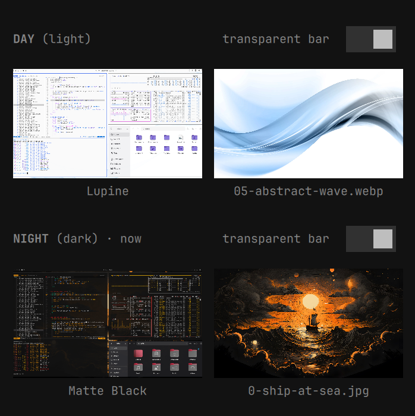
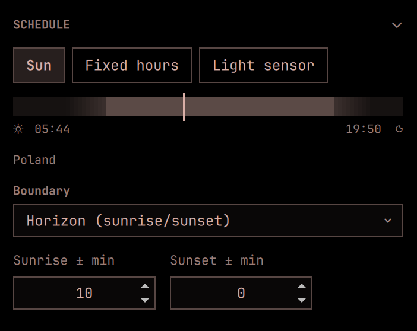
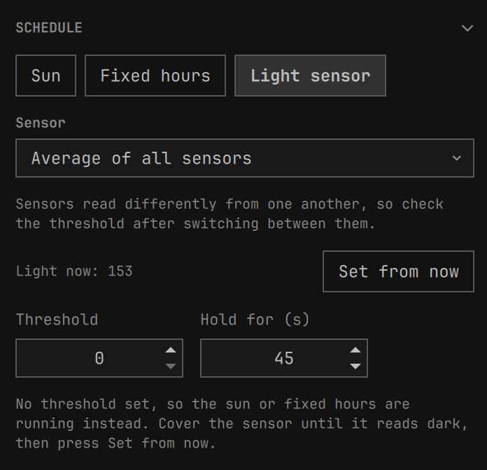
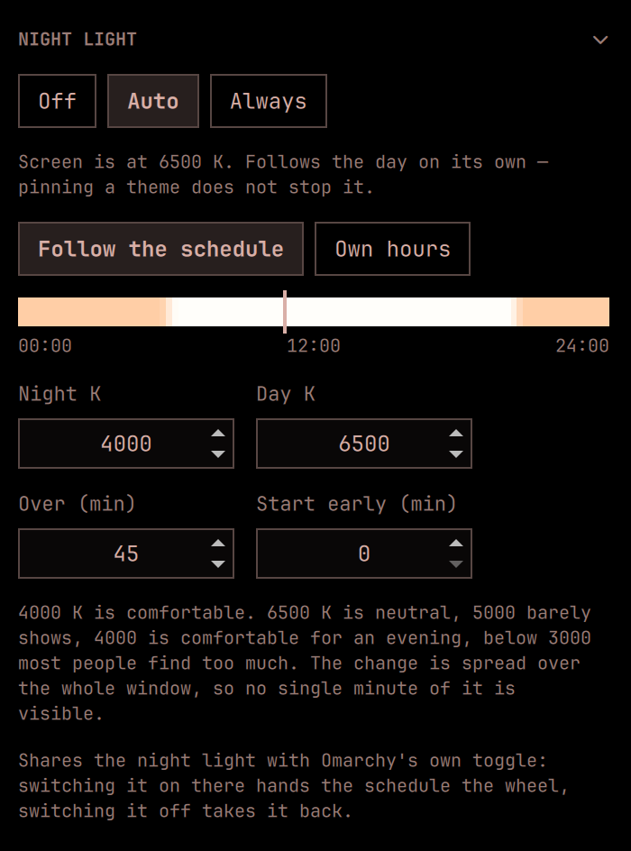
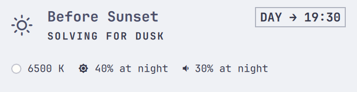
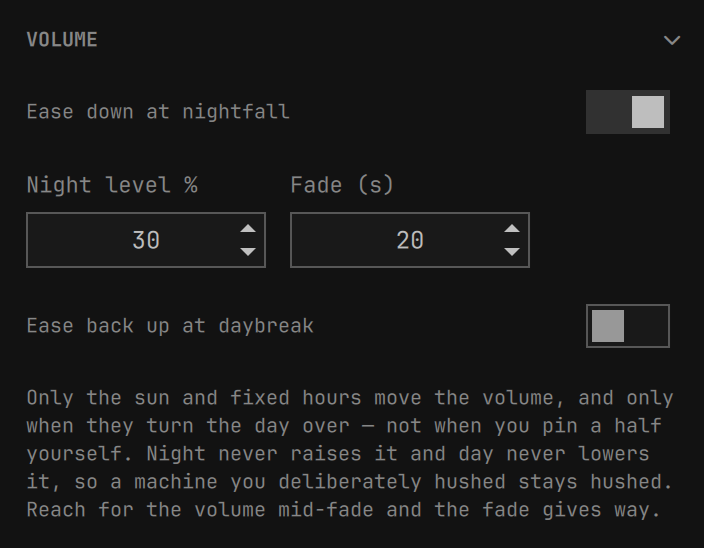

# Before Sunset

Follow the sun: one Omarchy theme through the day, another through the night,
each with its own wallpaper and its own answer to whether the top bar should be
transparent.


The name is a loose nod to Linklater's *Before Sunset*, and to the two films
either side of it — between them they cover sunrise, sunset and midnight. This
concerns itself with the same three moments, and with considerably less
conversation.

## Why this exists

Warp's terminal lets you nominate a light theme and a dark theme and then
forget about it — the editor follows the system, and each side keeps its own
look. I wanted that for the whole desktop, not one application: a bright theme
while the sun is up, something calmer after dark, each remembering the
wallpaper I picked for it, switching on its own.

Omarchy already has everything needed to do this well. Themes declare whether
they are light or dark, `omarchy theme set` retints the entire desktop in one
command, and the shell hosts long-running plugins. What was missing was
something to decide *when*, and somewhere to keep the two choices apart. That
is all this plugin is.

### It is not the only one

Other people have built versions of this — Darky, Dusk, Theme Scheduler,
NightMan, and probably more by the time you read it. Some I found only after
starting; some may not have existed yet. Go and look at them: one of them may
suit you better, and none of us is going to mind.

That several of these exist is not a problem to be solved. It is the whole
point of the arrangement. On this kind of system you can simply write the thing
you want, the way you think it ought to work, on the evening you decide you
want it — and then leave it out where the next person can take it or ignore it.
This one is a mix of what I liked in the others, my own ideas, and a run of
stray thoughts about how the day ought to turn over.

<details>
<summary><b>The longer answer, if you have a minute</b></summary>

<br>

My first Linux was Red Hat 5.0 — the one called Hurricane — in 1997. I was
thrilled by it, and stayed thrilled through a long run of distributions after
that. Then work happened. Windows for years, then macOS for more years, with
the occasional wistful glance over the fence at whatever the Linux world was
up to that decade.

Omarchy put me back over the fence, and it turns out I had missed it more than
I knew. I have not enjoyed anything this much in a long time: the poking, the
reading of other people's shell scripts, the discovery that the thing you
assumed was hard-coded is in fact a TOML file you are allowed to edit. It has
cost me an unreasonable number of hours lately. I regret none of them.

Before Sunset was meant to be a small thing for my own machine — pick two
themes, follow the sun, done by Tuesday. Then I kept asking what else was
possible, and it stopped being small. Somewhere along the way it grew opinions
about wallpapers, bar transparency, the volume after dark, and the exact colour
of the screen at twenty past nine.

This is where it got to. It is here as-is, in case it is useful to someone
else. Enjoy.

</details>

## What it does

- Switches themes at sunrise and sunset, computed locally from your
  coordinates — or at fixed clock times, or from an ambient light sensor if the
  machine has one.
- Remembers a background per theme and restores it, so an automatic switch
  never discards the wallpaper you chose.
- Remembers whether the top bar should be transparent per theme, because a
  wallpaper that works behind a transparent bar in one theme rarely does in
  another.
- Adopts any theme you pick elsewhere into whichever half of the day is
  running, so the schedule learns from what you actually do instead of
  fighting it.

## The two slots

The slots are called **day** and **night**, not light and dark, and they mean
exactly that: which half of the day they cover. Nothing stops you putting a
light theme in both — a bright one for daylight and a softer, warmer light
theme for the evening is a perfectly reasonable setup, and one the naming
would get in the way of if the slots were called "light" and "dark".

Each slot's theme is still labelled with what it reads as, because that is
useful to know. It just never constrains the choice.



## One rule

**A theme change lands in the slot that is currently in force.**

That holds wherever the change comes from — this panel, the theme switcher
(`Super + Ctrl + Shift + Space`), the Omarchy menu, `omarchy theme set`, a
keybinding of your own. Pick a theme during the day and it becomes your day
theme; pick one at night and it becomes your night theme. Nothing is reverted
behind your back, and nothing quietly expires at the next sunrise.

To step outside the schedule, pin a half. Pinning shows in the panel and stays
until you change it, which is the honest version of an override.

## Installation

```bash
omarchy plugin add https://github.com/priard/omarchy-before-sunset --enable
```

Then put the widget on the bar from the bar settings, or add it to
`~/.config/omarchy/shell.json` by hand:

```json
{ "id": "priard.before-sunset" }
```

The plugin seeds itself on first run: the theme already on screen takes the
slot matching its own light/dark reading, and the other slot gets a stock
counterpart. It starts working immediately without changing your desktop out
from under you.

## Removal

```bash
omarchy plugin remove priard.before-sunset
```

That leaves two things behind, both safe to delete:

```bash
rm ~/.local/state/omarchy/settings/before-sunset.json   # remembered backgrounds and transparency
```

and the plugin's entry in `~/.config/omarchy/shell.json`, if you added one by
hand. Your themes, wallpapers and bar settings are untouched — the plugin only
ever drove Omarchy's own commands.

## The panel

Click the bar icon. Right-click pins the other half without opening anything,
and pins back to Auto from there.

**MODE** — `Day` and `Night` pin one slot and stop the schedule. `Auto`
follows it.

**SCHEDULE** (Auto only) — how the half of the day gets decided. Options that
cannot work are not offered: `Sun` needs coordinates, `Light sensor` needs
hardware. A button that quietly does something else is worse than a button that
is not there.

*Sun* draws the day as a strip — night, the lit stretch, night again, with a
marker for now — and puts the boundary and offset controls under it, so those
settings show their result instead of describing it. `Boundary` chooses where
the day ends: the visible horizon, or one of the three twilights. The two
offsets nudge one side without moving the other.

*Fixed hours* takes a from/to pair.

The strip shades the twilight either side of the day block, out to where the
sky runs out of light. That span is the range `Boundary` can move the turn
across, so the control shows its own reach before you touch it. The block
itself keeps hard edges: a theme switch is a step, and drawing it as a fade
would be drawing something that does not happen.



*Light sensor* reads the ambient light sensor and decides from the room rather
than the clock — useful under heavy blinds, or in a basement where the sun has
no say. See below.

**THEMES** — one card per slot, showing the two pictures that actually decide
how that half of the day looks: the theme's own preview and the exact wallpaper
the slot will restore. Under them, what the theme reads as, which slot is in
force, and a transparency switch.

Click the theme to open Omarchy's theme picker. Click the wallpaper to pick a
different one from that theme's backgrounds. Themes are not required to ship a
preview image, so cards for those show the name instead of an empty frame.

Both pickers open with *that slot's* current choice selected, not the one on
screen — those differ whenever you are setting up the half of the day that is
not running. Browsing changes nothing, and a choice made for the inactive slot
is stored without touching the desktop.

## Location

Coordinates come from the location Omarchy already stores for the weather
widget, so it only has to be set once — in the Weather panel, or:

```bash
omarchy-weather-location --set "Warsaw" 52.22977,21.01178
```

Changing it there changes the schedule here. Setting `latitude` and
`longitude` in this plugin's own settings overrides it.

## Light sensor

Machines with an ambient light sensor expose it through the kernel's IIO
interface, one file per reading. The plugin reads it directly rather than
through `iio-sensor-proxy`, which is not installed everywhere and would be a
dependency for something `cat` already answers. Where no sensor exists the
option simply does not appear.

Readings are raw sensor counts scaled by the driver, **not calibrated lux**.
They differ by orders of magnitude between machines, so no default threshold
could mean anything. The panel therefore shows the live reading and a
**Set from now** button: put the room in the state you want to be the boundary,
press it, and the current reading becomes the threshold.

Two things keep the room from redecorating your desktop every time someone
walks past:

- **Hysteresis** — a band either side of the threshold where the sensor is
  given no opinion, so a reading sitting on the line does not oscillate.
  15% by default.
- **Hold for** — how long a changed reading has to persist before it counts.
  A hand passing over the sensor is not dusk. 45 seconds by default.

The first reading of a session commits immediately; there is nothing to flap
away from yet, and waiting would leave the desktop undecided for no reason.

If sensor mode is selected but no threshold has been set, or the sensor
disappears, the schedule falls back to the sun or fixed hours rather than
freezing: an unconfigured preference should not take the desktop down with it.



## Warming the screen after dark

Omarchy has a night light toggle: on or off, 4000 K or 6500 K, with nothing in
between. This adds the part in between — the screen eases from one to the other
across the turn of the day instead of stepping.

Three modes, and they are its own, not the theme's:

- **Off** — the plugin does not touch the night light, and Omarchy's toggle
  behaves exactly as it always has.
- **Auto** — follows the day, ramping across each turn.
- **Always** — holds the warm temperature around the clock.

Keeping this separate from the theme's mode matters: pinning a theme to Day
says something about colours on screen, not about whether your eyes want a
warmer picture at midnight. The schedule is computed either way, so the night
light — and the night volume — keep working while a theme is pinned.

### Its own hours, if you want them

By default the warming follows the same schedule the themes do. It does not
have to. **Own hours** gives it a from/to pair of its own, which is useful when
a theme should turn at sunset but the screen has no business warming until the
evening proper — and it gives the night light a timetable under the light
sensor, which has none.

### Choosing the numbers

Kelvin means little until you have seen it on your own screen, so as a rough
ladder:

| | |
|---|---|
| 6500 K | neutral, what hyprsunset calls identity |
| 5000 K | barely shows |
| 4000 K | comfortable for an evening — the default, and what Omarchy's own toggle means by "on" |
| 3400 K | strong |
| 2700 K | most people find this too much for anything but reading |

The span defaults to 45 minutes. That puts each minute's move around fifty
kelvin, which is below what the eye picks up against a room that is itself
getting darker — the whole point being that you never catch it happening. Twenty
minutes is noticeable if you are looking; anything under ten is a step with
extra stages.

The ramp begins as the day turns over and finishes a span later. If you would
rather already be warm by nightfall, **Start early** moves the beginning
forward by that many minutes.

### Seeing it

The section draws the whole day as a strip, tinted with the temperature the
screen will actually be at each point, with a marker for now. It is generated by
the same function that drives hyprsunset, so it cannot show one thing while
another happens.

It also answers a question the numbers do not. Switching to auto in the late
afternoon can look like it did nothing — and it did nothing, correctly, because
sunset has not come yet and the marker is still in the neutral stretch. The
strip makes that obvious instead of leaving it to be guessed at, and **Start
early** is right underneath if you would rather it began sooner.



A line under the panel heading carries the temperature on screen, in a swatch of
that colour, alongside the night volume, so neither needs its section opened to
be checked.



### Sharing the toggle

The ramp drives the same hyprsunset that Omarchy's toggle and bar indicator use,
so they see our changes as their own — the indicator calls anything under
6000 K "on". It only re-reads when told to, so it is refreshed after each step;
otherwise its icon would lie.

Going the other way: pressing that toggle switches this on or off to match. And
because the toggle is a statement about right now, pressing it at a time the
schedule disagrees with holds your choice until the day next turns over, rather
than being undone a minute later.

## Easing the volume down at night

Give the plugin a level and the output volume slides to it when the schedule
turns the day over. It is a slide, not a jump, and it shows no on-screen
display — nobody pressed a key, so nothing should flash.

The rules are deliberately one-directional. Night lowers and never raises; day,
if you enable it, raises and never lowers. A machine you deliberately hushed
stays hushed either way. Reach for the volume keys mid-fade and the fade gives
way, because someone pressing them has an opinion about the volume that
outranks the schedule's.

Only the sun and fixed hours move it, and only when they turn the day over.
Pinning a half yourself never does — that is you choosing a theme, not the day
ending. The light sensor never does either: a lamp switched on is not the
morning, and a room that brightens should not get louder.

The sink is resolved through `omarchy-audio-output-sink`, the same helper the
volume keys and the audio panel use, so a DSP or combined sink in front of the
hardware is honoured rather than bypassed.



## Backgrounds are remembered per theme

`omarchy theme set` picks a theme's *first* background whenever it enters that
theme, because the current-background symlink still points into the previous
theme's directory and matches nothing in the new one. Left alone, every
automatic switch would quietly discard the wallpaper you chose.

So the plugin watches which background is in use, remembers it per theme, and
on a switch applies the theme without touching the background before restoring
the remembered one. Pick a new wallpaper in the background switcher and that
becomes the remembered one from then on.

Only the filename is stored, never a path: the directory a background is
served from is staging, replaced wholesale on every theme switch.

## Bar transparency is remembered per theme

Each theme gets its own answer to whether the top bar should be transparent,
stored beside its background. Toggle it on a slot's row in the panel, or just
change it the usual way while a theme is on screen — that is recorded as that
theme's preference, the same as a background.

### When the wallpaper cannot be painted

A transparent bar is transparent *to something*. Omarchy already picks the bar
text colour by sampling the wallpaper strip behind it, so a light theme over a
dark wallpaper gets light text and vice versa — that part needs no help from
this plugin.

What breaks the arrangement is a wallpaper that never reaches the screen. Qt
renders a few formats itself and gets the rest from imageformat plugins; if the
decoder for a format is missing, the desktop paints black while every tool that
reads the file — the contrast helper included — sees the real picture and picks
the colour that contrasts with *that*. The bar ends up coloured for an image
nobody can see, and a light theme becomes black-on-black.

So before trusting transparency, the plugin checks whether the current
wallpaper's format has a decoder on this system. When it does not, transparency
is held off and the bar paints the theme's own `[bar] background` and
`[bar] text`, which is legible by construction. Your preference is captured
first and kept: the moment the format can be decoded, transparency comes back
on its own.

The check is deliberately one-sided. Reporting a format as decodable when it is
not costs an ugly bar until the wallpaper changes; reporting a decodable format
as broken would switch off transparency on a perfectly healthy desktop. Every
uncertain case — an unfamiliar extension, a Qt layout the check does not
recognise — is treated as fine and left alone.

On a stock Omarchy this rarely fires: the base install carries
`qt6-imageformats`, which covers the WebP most themes ship. It earns its keep
with themes that bring wallpapers in formats nothing on the system can read,
and on installs upgraded from an older Omarchy where that package never
arrived.

## Configuration

The panel writes these; hand-editing works too. Settings live in this plugin's
entry in `~/.config/omarchy/shell.json` — the bar layout entry when the widget
is on the bar, otherwise an entry in the top-level `plugins[]` array. That is
the same precedence the shell's own `updateEntryInline` uses.

```json
{
  "id": "priard.before-sunset",
  "dayTheme": "catppuccin-latte",
  "nightTheme": "matte-black",
  "mode": "auto",
  "autoMode": "sun",
  "twilight": "official"
}
```

| Key | Default | Meaning |
|-----|---------|---------|
| `dayTheme` | seeded | Theme for the day half. |
| `nightTheme` | seeded | Theme for the night half. |
| `mode` | `"auto"` | `auto` follows a schedule, `day` / `night` pin one slot, `off` parks the plugin without unloading it. |
| `autoMode` | `"sun"` | Which schedule `auto` follows: `sun`, `fixed`, or `sensor`. |
| `twilight` | `"official"` | Where the boundary sits: `official` (the visible horizon, i.e. sunrise and sunset), `civil` (~30 min later in the evening, earlier in the morning), `nautical`, `astronomical`, or a zenith angle in degrees. |
| `sunriseOffsetMinutes` | `0` | Shifts the morning switch. Negative is earlier. |
| `sunsetOffsetMinutes` | `0` | Shifts the evening switch. Negative is earlier. |
| `fixed` | `{"day":"07:00","night":"19:00"}` | Clock times for `autoMode: "fixed"`, and the fallback during polar day or polar night. |
| `latitude` / `longitude` | — | Override the shared weather location for this plugin only. |
| `notify` | `false` | Send a desktop notification on each switch and each adoption. |
| `sensor` | — | `{"threshold": 0, "hysteresis": 0.15, "dwellSeconds": 45, "device": ""}` for `autoMode: "sensor"`. A threshold of `0` means not calibrated yet; an empty `device` averages every sensor found. |
| `volume` | — | `{"night": 25, "day": null, "fadeSeconds": 20}`. Percentages; `null` leaves that side alone. `0` is a real target, meaning silence. |
| `nightlight` | — | `{"mode": "off", "source": "schedule", "fixed": {"day": "07:00", "night": "21:00"}, "day": 6500, "night": 4000, "transitionMinutes": 45, "leadMinutes": 0}`. `mode` is `off`, `auto` or `on`; `source` is `schedule` or `fixed`. |

Theme names accept either form: `"matte-black"` or `"Matte Black"`.

Remembered backgrounds and transparency live outside this entry, in
`~/.local/state/omarchy/settings/before-sunset.json`: they are state the plugin
observes, not configuration you would hand-write.

## CLI

```bash
omarchy-shell before-sunset status    # JSON: mode, slots, transitions, location, remembered state
omarchy-shell before-sunset toggle    # pin the other half, or hand control back to the schedule
omarchy-shell before-sunset day       # pin the day slot
omarchy-shell before-sunset night     # pin the night slot
omarchy-shell before-sunset auto      # follow the schedule again
omarchy-shell before-sunset refresh   # re-evaluate now, the same nudge a resume gives
```

Bind the toggle to a key in `~/.config/hypr/bindings.lua` if you want it on the
keyboard rather than the bar.

## How it works

`Sun.js` implements the US Naval Observatory almanac algorithm, cross-checked
against an independent NOAA solar-position implementation and agreeing with it
to within a minute across solstices, equinoxes and both hemispheres.

The service holds no countdown. Every tick recomputes, from scratch, which half
of the day the current instant falls in, and compares that against the theme
actually on screen. That is what makes it survive suspend, hibernate, clock
changes and daylight saving: a laptop opened after two days asleep corrects
itself on the next tick rather than waiting out a timer that never ran.

The tick is monotonic, so it does not run while the machine is suspended, and on
its own it would leave a laptop opened in the morning showing last night's theme
for the better part of a minute. So the resume is not waited for. logind
announces it on the system bus the moment it happens, ahead of the lock screen
asking for a password, and the schedule is evaluated there — which is early
enough that the right half of the day is already on screen behind the password
prompt. It is a shortcut rather than the mechanism: on a machine with no `gdbus`
the tick still corrects everything, just later.

Inside the polar circles there are stretches with no sunrise or sunset at all.
The schedule falls back to the `fixed` clock times so the desktop keeps some
rhythm instead of freezing on one theme for weeks.

Light and dark readings come from `omarchy-theme-color`, the same helper the
rest of Omarchy uses, so its precedence (`mode`, legacy `theme_type`, a
`light.mode` marker, then background luminance) is honoured rather than
reimplemented. Themes shipping only an `alacritty.toml` have no `colors.toml`
until applied, and are judged on their background with the same rule. This
reading is advisory: it labels the slots and seeds them on first run, and never
restricts what you can put where.

### Layout

```
manifest.json          plugin metadata
Service.qml            the schedule, adoption, and remembered state
BeforeSunsetPanel.qml     bar icon and settings panel
Sun.js                 sunrise/sunset, pure functions, no dependencies
bin/before-sunset-apply   switch a theme, restoring its remembered background
bin/before-sunset-pick    open the theme picker with a given theme preselected
bin/before-sunset-themes  list installed themes and which side each reads as
bin/before-sunset-bg-state  the current wallpaper, and whether Qt can decode it
bin/before-sunset-bg-pick   pick a wallpaper from any theme's backgrounds
bin/before-sunset-slot      resolve a slot's preview and wallpaper for the panel
bin/before-sunset-sensor    read the ambient light sensor, if there is one
bin/before-sunset-volume    ease the output volume to a level over a few seconds
bin/before-sunset-nightlight  read or set the screen colour temperature
bin/before-sunset-wake      report each resume from suspend, so the theme can catch up at once
```

## Requirements and dependencies

A stock Omarchy 4. Nothing to install.

The plugin shells out only to `bash`, `jq`, coreutils, and Omarchy's own
commands — `omarchy-theme-set`, `omarchy-theme-bg-set`, `omarchy-theme-color`,
`omarchy-theme-switcher`, `omarchy-menu-images`, `omarchy-audio-output-sink`,
`omarchy-notification-send` — plus `pactl` for the volume fade, `hyprctl`
for the night light, and `gdbus` for the resume announcement, all part of a
base install. It makes no network requests: sunrise and sunset
are arithmetic, not an API call.

It listens on the system bus for logind's resume announcement, which is a
broadcast signal: received with no privileges, and nothing is sent back.

It reads `/sys/bus/iio/devices/` for a light sensor, sets the output volume and
the screen colour temperature when you ask it to, and writes to exactly two
places: its own entry in `~/.config/omarchy/shell.json`, and
`~/.local/state/omarchy/settings/before-sunset.json`. It changes the bar's
`transparent` flag when a theme's remembered preference or an undecodable
wallpaper calls for it.

## Development

Saving a file under `~/.config/omarchy/plugins/` logs a plugin reload, but a
running service instance keeps its old code and its IPC target, and a mounted
bar widget keeps its old code too. Run `omarchy restart shell` after editing
the QML, before concluding anything about behaviour.

## Changelog

See [CHANGELOG.md](CHANGELOG.md).

## License

MIT. See [LICENSE](LICENSE).
